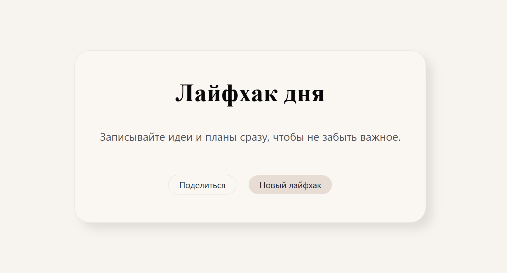

# Лайфхак дня

Сайт для вдохновения и упрощения жизни на каждый день. Показывает случайный лайфхак, помогает записывать идеи и мгновенно делиться полезными советами в соцсетях.

## О проекте

"Лайфхак дня" — одностраничное приложение (SPA), созданное для быстрой мотивации и обмена полезными советами. Каждый день вы получаете новый лайфхак и можете поделиться им с друзьями в популярных социальных сетях.

## Технологии

- React
- TypeScript
- Vite
- ChakraUI

## Функционал

- Генерация случайного лайфхака дня
- Кнопка «Новый лайфхак» для получения другого совета
- Возможность поделиться лайфхаком в VK, Facebook, Telegram, WhatsApp, Instagram
- Интерфейс полностью на русском языке

## Структура проекта

coverage/ // отчет о покрытии тестами
public/ // статические файлы и assets
src/ // исходный код приложения
├── assets/ // изображения, иконки
├── components/ // React компоненты
├── page/ // страницы SPA
tests/ // директория с тестами

## Запуск и установка

Установка зависимостей:
npm install

## Запуск проекта в режиме разработки:

npm run dev

## Тестирование

Покрытие тестами: 78%

## Автор

Анна Одинцова
